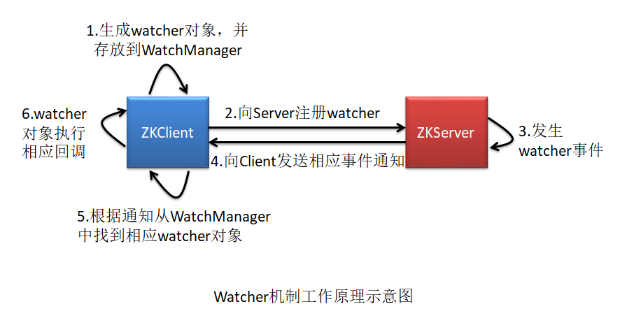

# Zookeeper基础篇

[Zookeeper官网](http://zookeeper.apache.org/)

[Zookeeper 3.5.5 Doc](http://zookeeper.apache.org/doc/r3.5.5/)

## 分布式基础

单机负载问题  

分布式session存储问题（Session sticky、Session Replication、Session Center）  

单点问题  

数据库性能问题（表/字段/sql优化、分库分表、读写分离）  
数据库读写分离的延迟问题（sharding-sphere、mycat、atlas都带有企业级解决方案）  
读写分离降低了主库的读压力，没有解决写的压力；
要解决降低写的压力要引入分库分表  
分库分表又会引入分布式事务问题

大数据量搜索问题（es、solr）  
引入搜索引擎，又会引入数据同步问题。

某些临时访问量很高的数据使用缓存。

文件存储
要避免单点问题，使用分布式文件系统。

系统分模块开发分开测试部署，要做业务垂直拆分。  
然后需要引入网络通信RPC（HSF、Dubbo）  
一个简单的业务可能需要很多RPC通信  
会引入调试困难的情况（需要链路追踪和ELK日志分析解决）  

高并发场景下要防止各个子系统不堪重负，  
要在中间插入分布式消息中间件
但是可能会出现数据丢失、堆积、幂等性问题  
幂等性问题解决方案：全局唯一ID、去从表、状态机


## Zookeeper基础

监控、协调系统组件， 比如某个子服务挂掉了，通知服务调用者去调用另一个“镜像”子服务。

### 服务节点的角色

+ **Leader**

  写(FIFO)；节点唯一。

+ **Follower**

  读；具有选举权。

+ **Observer**

  分摊读负载；一旦observer被重启，需要从leader重新同步整个名字空间（TODO）。

### ZNode

#### ZNode属性

```shell
cZxid: Created Zxid,表示当前 znode 被创建时的事务 ID
ctime: Created Time,表示当前 znode 被创建的时间
mZxid: Modified Zxid,表示当前 znode 最后一次被修改时的事务 ID
mtime: Modified Time,表示当前 znode 最后一次被修改时的时间
pZxid: 表示当前 znode 的子节点列表最后一次被修改时的事务 ID。注意,只能是其子节点列表变更了才会引起 	  
       pZxid 的变更,子节点内容的修改不会影响 pZxid。
cversion: Children Version,表示子节点的版本号。该版本号用于充当乐观锁。
dataVersion: 	表示当前 znode 数据的版本号。该版本号用于充当乐观锁。
aclVersion: 	表示当前 znode 的权限 ACL 的版本号。该版本号用于充当乐观锁。
ephemeralOwner: 若当前 znode 是持久节点,则其值为 0;若为临时节点,则其值为创建该节点的会话的 
				SessionID。当会话消失后,会根据 SessionID 来查找与该会话相关的临时节点进行删除。
dataLength: 	当前 znode 中存放的数据的长度。
numChildren: 	当前 znode 所包含的子节点的个数。

比如：
[zk: localhost:2184(CONNECTED) 4] get /test
test
cZxid = 0x100000003
ctime = Fri Mar 27 20:38:53 CST 2020
mZxid = 0x100000003
mtime = Fri Mar 27 20:38:53 CST 2020
pZxid = 0x100000003
cversion = 0
dataVersion = 0
aclVersion = 0
ephemeralOwner = 0x0
dataLength = 4
numChildren = 0
```

#### ZNode类型

+ **持久**（**PERSISTENT**）

  持久节点会一直存在除非手动删除。

+ **持久有序** (**PERSISTENT_SEQUENTIAL**)

  有序指创建同名节点会自动在节点名后添加一个自增的数字。

+ **带有生存时间的持久节点**（**PERSISTENT_WITH_TTL**）

  超时时间内没有被修改，一旦到达超时时间且不含子节点会被立即删除。

+ **带有生存时间的持久有序节点**（**PERSISTENT_SEQUENTIAL_WITH_TTL**）

+ **临时** (**EPHEMERAL**)

  临时节点与客户端会话生命周期绑定，客户端会话失效（不是TCP连接断开）后节点会被删除（TODO）；

  临时节点不能有子节点。

+ **临时有序** (**EPHEMERAL_SEQUENTIAL**)

+ **CONTAINER**

  为某些特殊功能（leader、lock等）实现的节点类型，当最后一个子节点被删除则此节点会在未来某个时间点被删除；

TODO：

2）什么时候算是会话失效？

#### Chroot特性

实现公用一个Zookeeper集群情况下对不相干的应用的隔离，每个应用只对应其中一棵子树。

### ACL(Access Control List)

[Zookeeper ACL](http://zookeeper.apache.org/doc/r3.5.5/zookeeperProgrammers.html#sc_ZooKeeperAccessControl) 官方文档写的不清不楚。

ACL（Access Control List） 用于控制节点的创建，删除，读取，更新 及 权限设置。

一般表示为`scheme:id:permissions`或`scheme:expression:permissions`。

> ACL是细粒度的权限管理策略，Linux UGO是粗粒度的权限管理策略。
>
> 粗细粒度权限管理的理解：个人认为针对个体的权限管理设置就是细粒度的，针对某个群体的权限管理设置是粗粒度的。
>
> Unix/Linux现在也支持ACL, 子目录／子文件默认继承父目录的ACL;
>
> ZK中的ACL子znode不会继承父znode的ACL。

授权策略（scheme），常用的策略：

+ world：对所有人开放的权限，world下只有一个用户/id anyone，那么组合的写法就是world:anyone:[permissions]

+ auth：用户名密码认证，形式为auth:user:password:[permissions]

+ digest：用户名＋加密的密码认证，组合形式为digest:username:BASE64(SHA1(password)):[permissions]

  auth与digest的区别就是，前者明文，后者密文setAcl /path auth:lee:password:cdrwa与setAcl /path

  digest:lee:BASE64(SHA1(password)):cdrwa是等价的，在通过 addauth digest lee:password后都能指定操作指定节点的权限

+ ip：指定的IP拥有此节点的访问权限，比如ip:192.168.1.1:[permissions]

+ super：代表超级管理员，拥有所有的权限

  工作原理和auth/digest是类似的，不过需要在配置文件中指定密码

  ```shell
  #比如设置超级管理员密码为admin, 即super:admin。
  "-Dzookeeper.DigestAuthenticationProvider.superDigest=super:xQJmxLMiHGwaqBvst5y6rkB6HQs="
  ```

授权对象（id）

权限分类（permission, 类似Linux rwx）：

+ CREATE(c)（创建子节点）
+ READ(r)（读节点数据和子节点列表）
+ WRITE(w)（写节点数据）
+ DELETE(d)（删除子节点）
+ ADMIN(a)（设置用户权限的权限）

命令行示例：

```shell
#查看某个节点的ACL
[zk: localhost:2184(CONNECTED) 43] getAcl /test/e-node
'world,'anyone
: cdrwa
#创建时设置节点的ACL,如：所有人分配cdrw权限
[zk: localhost:2184(CONNECTED) 44] create /test/acl-node "test acl node" world:anyone:cdrw
'world,'anyone
: cdrw
#尝试重新设置权限，发现不被允许（因为没有a权限）
[zk: localhost:2184(CONNECTED) 48] setAcl /test/acl-node world:anyone:cdrwa
Authentication is not valid : /test/acl-node
#auth认证，必须先用addauth注册用户名密码，因为创建auth权限节点需要先认证用户名和密码
#addauth digest lee:123456，相当于web登录时输入用户名和密码
[zk: localhost:2184(CONNECTED) 50] addauth digest lee:123456
[zk: localhost:2184(CONNECTED) 51] create /test/acl-auth-node "test acl auth node" auth:lee:123456:cdrwa
Created /test/acl-auth-node
#上面的create操作和下面是等效的
[zk: localhost:2184(CONNECTED) 51] create /test/acl-auth-node "test acl auth node" digest:lee:d10P4dEqSdWLiUITSkI0kS/aMKg=:cdrwa
Created /test/acl-auth-node
#重新开启一个zkCli连接，需要重新输入 addauth digest lee:123456,然后才能访问/test/acl-auth-node节点
[zk: localhost:2184(CONNECTED) 2] get /test/acl-auth-node
Authentication is not valid : /test/acl-auth-node
[zk: localhost:2184(CONNECTED) 3] addauth digest lee:123456
#设置可以cdrwa的ip白名单
[zk: localhost:2184(CONNECTED) 56] create /test/acl-ip-node ip:127.0.0.1:cdrwa
Created /test/acl-ip-node
```

### Watcher（事件通知）

是发布/订阅模式的实现，客户端创建包含方法回调的Watcher并注册到事件的Watcher列表。

#### 事件类型


#### Watcher的特性

+ **一次性**

  不适合监听变化非常频繁的场景。

+ **Watcher回调是一个串行同步过程**

  遇到回调业务逻辑繁重的情况，需要放到单独的线程中处理。

+ **轻量**

  Watcher通知只包含通知状态、时间类型和节点路径。

#### Watcher的使用


#### Watcher工作原理



注意：向Server注册watcher是将客户端自己的地址信息、要监听的znode和watcher事件注册到zkServer。

源码分析参考：《Zookeeper实现原理.md》。

### Session会话与管理

客户端和服务端之间建立的一个TCP长连接`org.apache.zookeeper.ClientCnxn`（TODO：存在异议）。

#### 会话状态

+ **CONNECTING**（连接中）

  客户端要创建连接,首先会在客户端创建一个 ZooKeeper 对象（即进入CONNECTING状态）。客户端会采用轮询方式逐个获取服务器列表中的 zk 的 IP 进行连接尝试,每轮询一遍等待1000ms后重新尝试，直到连接成功。注意,在轮询之前,首先会将服务器列表打散,然后再进行轮询。

+ **CONNECTED**(已连接)

+ **RECONNECTING**

+ **RECONNECTED**

+ **CLOSED**(已关闭)

  若出现会话超时、权限验证失败或客户端主动退出等情况，客户端状态就变为CLOSED。此时客户端的ZooKeeper对象就消失了。

#### 会话连接超时管理

当客户端向 zk 发出连接请求后,是如何知道是否连接成功的呢?

当 zk 接收到某客户端会话连接后,其会向该客户端发送连接成功 ACK。当客户端接收到 ACK 后,就知道自己已经
与 zk 建立了连接。

若 zk 没有收到连接请求,或客户端没有收到 zk 发送的 ACK 怎么办呢?

客户端就需要进行等待,直到发生会话连接超时。然后再进行下一次连接尝试。当然,尝试一直连接不上怎么办?这就依赖于连接时设置的超时重试策略了。会话连接超时是由客户端维护的。

另外还有一个读超时时间，即允许的连接空闲时间(没有向服务端发消息的空闲时间)，如果发生读超时或者连接超时就会抛出SessionTimeoutException。

#### 会话空闲超时管理（重要）

zk 为每一个客户端都维护着空闲超时管理。一旦空闲超时,服务端就会认为该客户端已丢失,其会将该会话的 SessionId 从服务端清除。这也就是为什么客户端在空闲时需要定时向服务端发送心跳,就是为了维护这个会话长连接的。服务器是通过空闲超时管理来判断会话是否发生中断的。

会话空闲超时管理是由服务端维护的。其采用了一种特殊的方式——分桶策略。

+ 分桶策略

  会话在zkServer中在一个个的会话桶（SessionSet）中存储；会话超时并不是实时删除，而是一桶一桶地删除，在每个桶的超时时间清除。会话通过心跳可以更新移动到后面的桶中。

#### 会话连接事件

客户端与服务端的长连接失效后,客户端将进行重连。在重连过程中**客户端**会产生三种会话连接事件:

+ 连接丢失

  客户端长时间没有获取服务端的ACK。

+ 会话转移

  连接丢失后重新连接其他服务器节点连接成功，sessionId不变，改变了ZooKeeper对象中连接服务属性。

+ 会话失效

  连接丢失后重新连接，一直连接不成功，最终服务端因为没有心跳维持会话，将会话删除掉了（所有服务节点中此会话一并删除），而客户端还在不断重试连接，连接成功后服务节点确找不到此会话信息。

#### 可视化客户端

+ **ZooViewer**

+ **ZooInspector**(推荐)

  官方自带的模块，编译打包详细参考：https://github.com/apache/zookeeper/blob/master/zookeeper-contrib/zookeeper-contrib-zooinspector/README.txt

  也可以使用https://github.com/zzhang5/zooinspector，只需要mvn clean package即可，然后将target/zooinspect-pkg拷贝到自己的软件目录下，添加环境变量，执行。

### 一致性协议

+ ZAB
+ Paxos
+ Raft
+ BASE

### Leader选举

#### 选举后的数据同步

#### 节点宕机处理

### 数据同步

### 数据与存储

### 常用终端命令

连接服务端后，输入`help`可以查看所有命令。

关于命令参数含义（比如： -s -w）可以参考源码的 `org.apache.zookeeper.cli.XxxCommand`（官方文档没找到详细的解释）, 但是3.5.5版本Zk几乎针对每一个命令定义了一个类（源码定义了参数的解析和命令的执行）。

```java
//连接后的命令的执行
CliCommand cliCmd = commandMapCli.get(cmd);
cliCmd.setZk(zk);
watch = cliCmd.parse(args).exec();
```

这里以`ls`命令为例，解析下命令的解析和执行，参考《Zookeeper源码分析篇》。

```shell
close					#关闭连接
connect host:port		#重新连接目标IP：端口
config [-c] [-w] [-s]	#对应类GetConfigCommand，
reconfig [-s] [-v version] [[-file path] | [-members serverID=host:port1:port2;port3[,...]*]] | [-add serverId=host:port1:port2;port3[,...]]* [-remove serverId[,...]*]				#
quit					#关闭连接并退出客户端
history					#和linux的一样
redo cmdno				#相当于linux的 !cmdno

create [-s] [-e] [-c] [-t ttl] path [data] [acl]	#创建节点 -s：顺序节点 -e：临时节点 -c： ttl：生存时间 data：数据 acl：访问控制列表
delete [-v version] path	#删除节点
deleteall path				#删除节点和此节点的所有子节点
setquota -n|-b val path		#设置节点限额 -n:限制子节点个数 -b:限制值的长度
delquota [-n|-b] path		#删除限额
setquota -n|-b val path		#查看节点限额信息
ls2 path [watch]		#已被弃用，推荐使用 ls [-s] path
rmr path								#递归删除节点
set [-s] [-v version] path data			#设置节点值
sync path				#强制同步，由于请求在半数以上的zk server上生效就表示此请求生效，那么就会有一些zk server上的数据是旧的，需要强制同步获取最新数据

#监控相关
printwatches on|off		#设置显示监视状态
get [-s] [-w] path		#获取某节点的内容 -s:带上stats信息 -w:添加节点监控
ls [-s] [-w] [-R] path	#查看某节点下子节点 -w:添加子节点监控(监听创建事件) -s:
stat [-w] path			#查看某节点的状态 -w:添加节点监控
removewatches path [-c|-d|-a] [-l]		#

#ACL官网讲的不明不白的，单独拉出来
addauth scheme auth		#
setAcl [-s] [-v version] [-R] path acl	#设置节点ACL，如：setAcl /node world:anyone:cdrw
getAcl [-s] path		#获取某节点的访问控制列表
```

TODO：

1）deleteall 和 rmr 的区别是什么？

2）

## Zookeeper 集群部署

### Zookeeper 配置

官网没有文档集中总结

```
#基础配置
tickTime=2000				#心跳ms
dataDir=/xxx/zookeeper/data	#数据存放目录
clientPort=2181				#客户端连接的服务端端口
clientPortAddress=172.0.0.1	#将clientPort绑定到某个IP（针对服务器有多个网络接口的情况）
#高级配置
dataLogDir=/xxx/zookeeper/log	#事务日志存储目录
globalOutstandingLimit=1000		#请求并发数量，默认1000
preAllocSize=64M				#预分配内存空间，默认64M，当可用空间小于4K会继续分配64M
snapCount=
initLimit=5						#接受客户端链接zk初始化的最长等待心跳时长 initLimt*ticktime
syncLimit=2						#其他ZK服务器连接到Leader的过期时间
server.A=B:C:D					#A:第几号服务器（1,2..）B:服务IP C:Leader和Follower通信端口 
								#D:选举Leader端口

```

### Docker 在单机部署真集群

1）首先拉取Zookeeper官方镜像

```shell
docker pull zookeeper:3.5.5
```

2）启动镜像创建zookeeper的docker容器

官方提供了一种简单的部署方法 `stack deploy`(专门用于docker部署集群)和docker-compose部署方式差不多。

需要配置 `stack.yml`:

创建3个服务节点，每个节点将2181端口（默认的客户端连接的服务端端口）分别映射得到物理及的2181、2182、2183。而3个服务节点间直接通过docker网络实现互联。

服务端通讯端口 : 2888
服务间选举端口：3888

```yaml
version: '3.1'

services:
  zoo1:
  	#改为下载的zookeeper镜像版本
    image: zookeeper:3.5.5
    restart: always
    #zk节点服务器名
    hostname: zoo1
    ports:
      - 2181:2181		
    environment:
      #服务节点ID, 即myid文件中的值
      ZOO_MY_ID: 1
      #服务节点列表
      ZOO_SERVERS: server.1=0.0.0.0:2888:3888;2181 server.2=zoo2:2888:3888;2181 server.3=zoo3:2888:3888;2181

  zoo2:
    image: zookeeper:3.5.5
    restart: always
    hostname: zoo2
    ports:
      - 2182:2181
    environment:
      ZOO_MY_ID: 2
      ZOO_SERVERS: server.1=zoo1:2888:3888;2181 server.2=0.0.0.0:2888:3888;2181 server.3=zoo3:2888:3888;2181

  zoo3:
    image: zookeeper:3.5.5
    restart: always
    hostname: zoo3
    ports:
      - 2183:2181
    environment:
      ZOO_MY_ID: 3
      ZOO_SERVERS: server.1=zoo1:2888:3888;2181 server.2=zoo2:2888:3888;2181 server.3=0.0.0.0:2888:3888;2181
```

启动stack deploy：

```shell
#docker swarm init
docker stack deploy -c stack.yml zoos 	#zoos是集群容器名的前缀（或者说集群的名字）
#或
docker-compose -f stack.yml up
```

docker  stack 会自动为集群（如zoos）创建network。

查看启动状态

```shell
docker ps 
docker-compose ps
```

查看zookeeper配置信息

```
docker exec -it zoos_zoo2.1.e38riqilm20psu51hyqh6vx2y /bin/bash
cat /conf/zoo.cfg
#文件内容：
#dataDir=/data
#dataLogDir=/datalog
#tickTime=2000
#initLimit=5
#syncLimit=2
#autopurge.snapRetainCount=3
#autopurge.purgeInterval=0
#maxClientCnxns=60
#standaloneEnabled=true
#admin.enableServer=true
#server.1=zoo1:2888:3888;2181
#server.2=0.0.0.0:2888:3888;2181
#server.3=zoo3:2888:3888;2181
```

3）本地主机连接ZK docker集群

```shell
zkCli.sh -server localhost:2181;localhost:2182;localhost:2183
```

TODO：

1）使用集群部署创建多个服务节点是不是就算ZK高可用集群了？

### Zookeeper监控与运维

## 附录

+ jps

  查看java进程的PID和Main类名。

+ IDEA zookeeper 插件

  可以以树状结构显示所有节点。