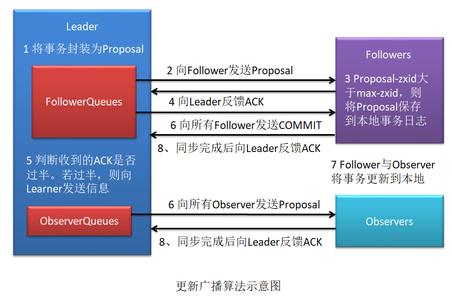
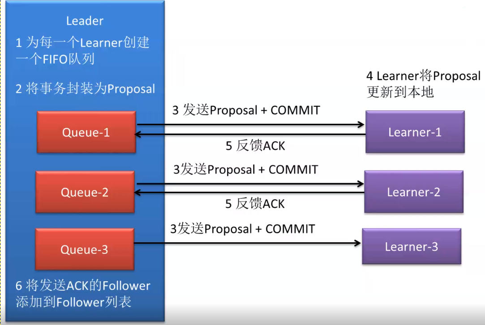
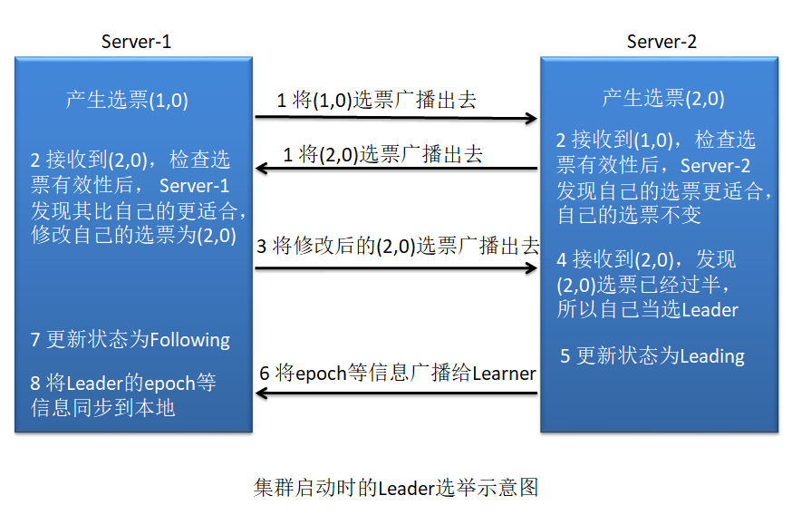
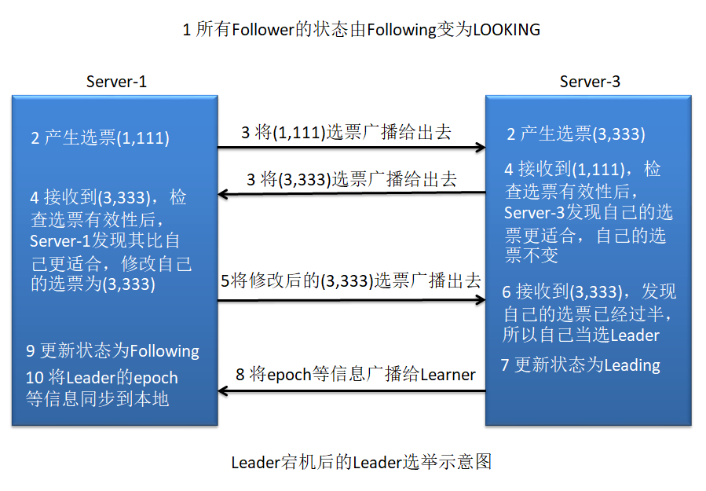
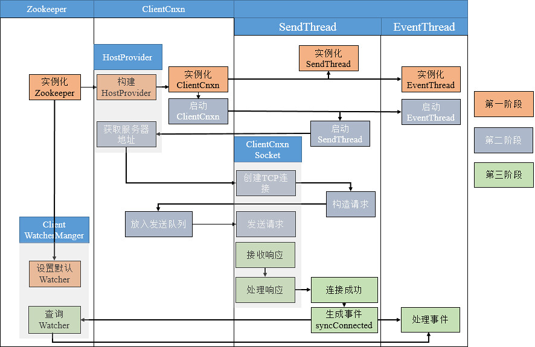

# ZooKeeper实现原理

一个开源的分布式应用程序协调服务器，其为分布式系统提供**一致性服务**。其一致性是通过基于 Paxos 算法的
ZAB 协议完成的。其主要功能包括:配置维护、域名服务、分布式同步、集群管理等。

ZK节点结构：树状结构。

ZK特点：

+ **顺序一致性**:zk 接收到的 N 多个事务请求(写操作请求),其会被严格按照接收顺序应
  用到 zk 中。
+ **原子性**:所有事务请求的结果在 zk 集群中每一台主机上的应用情况都是一致的。要么
  全部应用成功,要么全部失败。
+ **单一视图**:无论 Client 连接的是 zk 集群中的哪个主机,其看到的数据模型都是一致的。
+ **可靠性**:一旦 zk 成功应用了某事务,那么该事务所引发的 zk 状态变更会被一直保留下
  来,直到另一个事务将其修改。
+ **最终一致性**:一旦一个事务被成功应用,zk 可以保证在一个很短暂时间后,Client 最终
  能够从 zk 上读取到最新的数据状态。注意,不能保证实时读取到。


## 基础理论

### Paxos算法

保证分布式系统就某个决议达成一致。

Paxos 算法的前提是不存在拜占庭将军问题（信道不安全）,即信道是安全的、可靠的,集群节点间传
递的消息是不会被篡改的。

一般情况下,分布式系统中各个节点间采用两种通讯模型:共享内存(Shared Memory，存在单点问题)
、消息传递(Messages Passing，如网络；去中心化)。而 Paxos 是基于消息传递通讯模型的。

**三种角色**：

+ Proposer：提案者（一个或多个）
+ Acceptor：表决者（多个，超过半数同意才能通过提案）。
+ Learner：学习者,同步者。

**Paxos 3PC**（和数据库事务控制３PC类似但不同）:

+ prepare 阶段（面对直到有半数表决者同意为止）
+ accept 阶段（面对全部表决者）
+ commit 阶段（让全部表决者更新本地提案信息）

**Paxos活锁问题**：

比如有两个节点A、B，Ａ先发出一个提案（N=1）,A、Ｂ在prepare阶段都表决通过，本地maxN都更新为１然后时间片耗尽；然后Ｂ提出一个提案（N=2），A、Ｂ在prepare阶段都表决通过，本地maxN都更新为２然后时间片耗尽；这时继续执行第一个未完成的提案，在accept阶段，Ａ再次表决发现maxN>1，提案失效，然后Ａ重新提交提案(N=3)然后时间片耗尽；继续执行Ｂ的提案，accept阶段发现maxN>2,提案失效，然后Ｂ重新提交提案（N=4）, 然后A、Ｂ、A、Ｂ...重复提交和失败。

Fast Paxos算法解决活锁：只允许一个进程提交提案。

### Paxos实现

#### ZAB（Zookeeper Atomic Broadcast）

专为ZK设计的一种支持崩溃恢复的原子广播协议，在ZK中，主要依赖ZAB协议实现分布式数据一致性。

ZK使用一个单一主进程（Leader, 唯一的提案者）来接收并处理客户端的所有事务请求,即写请求,解决了活锁问题。

当服务器数据的状态发生变更（写请求）后,集群采用 ZAB 原子广播协议,以事务提案 Proposal 的形式广
播到所有的副本进程上。ZAB 协议能够保证一个全局的变更序列,即可以为每一个事务分配一个全局的递增编号 xid。

若客户端提交的是读请求,那么当前节点就直接根据自己保存的数据对其进行响应;

如果是写请求且当前节点不是Leader,那么节点就会将该写请求转发给 Leader,Leader 会以提案的方式广播该写操作,只要有超过半数节点同意该写操作,则该写操作请求就会被提交。然后 Leader 会再次广播给所有订阅者,即 Learner,通知它们同步数据。

<u>zk 集群对于事务请求的处理是 Fast Paxos 算法的体现,即只允许 Leader 提出提案</u>。其属于 3PC 提交。
但 <u>Leader 选举是 Paxos 算法的体现,因为 Leader 宕机后,所有 Follower 均可提交提案</u>,它们在最初都是“我选我”。其属于 2PC 提交。

##### 三种角色：

+ Leader：事务请求（写）唯一处理者（需要Follower表决支持），也可以处理读请求；
+ Follower：处理读请求，写请求转发给Leader,  Leader挂掉后可以参与Leader选举可被选举为Leader；
+ Observer：和Follower工作相同，但是没有表决权和选举权。

Leader好比项目经理，Follower好比正式员工，Observer好比外包员工，项目经理离职了，可以从内部员工中选出新的项目经理。

Observer替换Follower可以保持同样负载能力下，减少选举和表决压力，即并不需要太多拥有表决权和选举权的节点，否则可能导致表决和选举效率低下。

Paxos Learner：学习者,同步者。Learner = Follower + Observer
QuorumPeer = Participant = Leader + Follower

##### 三个数据

+ zxid (事务ID) :64 位长度的 Long 类型,其高 32 位为 epoch,低 32 位为 xid
+ epoch (任期的意思，表明当前是第几代Leader): 每一个新的 Leader 都会有一个新的 epoch,在之前的Leader的epoch值基础上加１
+ xid (纯事务ID):其为一个流水号

##### 四种状态

+ LOOKING：选举状态
+ FOLLOWING：Follower 的正常工作状态
+ OBSERVING：Observer 的正常工作状态
+ LEADING：Leader 的正常工作状态

ZK一旦一个提案通过，在这个提案提交之前，所有参与同意此提案的节点都不能继续对其他提案进行表决。是通过状态控制实现的，但是并不是对应上面四个状态，从而避免了之前的通过的提案还没处理完就被新提案给“截胡”的问题（比如解决Leader选举commit阶段截胡问题）。

##### 三个模式

这三种模式是对 zkServer 工作状态的描述。

+ **同步模式**：其可以分为两类:初始化同步,与更新同步

  初始化同步：流程看下面图示；

  更新同步：？

+ **广播模式**：其可以分为两类:初始化广播,与更新广播

  初始化广播：？

  更新广播：

  

  为何要做Proposal-zxid和max-zxid (即前面说的的maxN)的大小比较？什么情况下Proposal-zxid不大于max-zxid（明明只有Leader可以发送Proposal）？

  为了防止万一因为网络抖动等原因，导致上一个提案晚于下一个提案到达ZK的某个或某些Learner。如果没有比较会发生旧的提案覆写新的提案。

  上面的问题如果是两个提案是操作的不同的ZNode呢？有Proposal-zxid和max-zxid 比较的话会不会导致上一个提案因为迟于下一个提案到来导致上一个提案的数据没有写入？

  不会出现上述情况，因为Learner从Leader同步数据是类似递归（实现是for循环）的实现，从max-zxid（假设５）开始，往下查4,3...直到找到Leader和Learner所有ZNode节点数据一致的zxid开始（假如２），向上同步3,4,5 Leader所有数据到Learner（**每个ZK服务节点都有队列存储历史数据**）。

+ **恢复模式**：其包含两个重要阶段:Leader 的选举,与初始化同步

  阶段一：Leader选举

  阶段二：初始化同步

  

  １）为了保证 Leader 向 Learner 发送提案的有序,Leader 会为每一个 Learner 服务器准备一
  个队列；
  ２）Leader 将那些没有被各个 Learner 同步的事务封装为 Proposal
  ３）Leader 将这些 Proposal 通过队列逐条发给各个 Learner,并在每一个 Proposal 后都紧跟一个COMMIT 消息,表示该事务已经被提交,Learner 可以直接接收并执行

  ４）Learner 接收来自于 Leader 的 Proposal,并将其更新到本地
  ５）当 Learner 更新成功后,会向准 Leader 发送 ACK 信息
  ６）Leader 服务器在收到来自 Learner 的 ACK 后就会将该 Learner 加入到真正可用的 Follower
  列表或 Observer 列表。没有反馈 ACK,或反馈了但 Leader 没有收到的 Learner,Leader不会将其加入到相应列表。

##### Observer数量选择

Learner向Leader同步数据，Follower同步完成就会停止同步(至少超过一半Follower同步成功，同步失败的Follower不能提供服务)，不会等待Observer同步完成；未同步完成的Observer无法向外提供服务(状态不是Observing, Client如果连接到这种服务节点会判断状态，然后重连其他的可服务节点)。

Leader 中保存的 Observer 列表(ObserverQueues)其实有两个:

+ 假设叫all, 包含所有 Observer
+ 假设叫service, 存储已经完成了从 Leader 同步数据的Observer。service <= all。其是动态的

Leader 中保存的 Follower 列表(FollowerQueues)其实也有两个:

+ 假设叫all, all要求其中必须有过半的 Follower 向 Leader 反馈 ACK
+ 假设叫service，存储已经完成了从 Leader 同步数据的Follower

##### Leader选举

###### 基本概念

+ serverId

  对应ZK配置的myid。

+ 逻辑时钟

  是一个整型数,该概念在选举时称为 logicalclock，而在选举结束后称为 epoch。

###### Leader选举算法

集群启动的Leader选举和Leader宕机后的Leader选举略有不同。

+ **集群启动时Leader选举**

  

  投票包含所推举的服务器的 myid 和 ZXID,使用(myid, ZXID)来表示。

  选票选择算法：

  １）先判断接收到的投票的有效性,如选票是否已经过半，如果已经过半自己直接更新状态为Following；否则检查是否是本轮投票、是否来自 LOOKING 状态的服务器。

  ２）针对每一个投票，服务器都需要将别人的投票和自己的投票进行 PK，PK规则如下:

  ​		优先检查 ZXID。ZXID 比较大的服务器优先作为 Leader。
  ​		如果 ZXID 相同,那么就比较 myid。myid 较大的服务器作为 Leader 服务器 ，然后PK输掉的主机修改投票为获胜的主机。

+ **Leader宕机后的Leader选举**

  和集群启动时的Leader选举不同的一点是选票的zxid可能不一样。

  

##### 恢复模式的三个原则

１）Leader主动出让原则

若集群中 Leader 收到的 Follower 心跳数量没有过半,此时 Leader 会自认为自己与集群的连接已经出现了问题,其会主动修改自己的状态为 LOOKING,去查找新的 Leader。

２）已被处理的消息不能丢

如果在非全部 Follower 收到 COMMIT 消息之前 Leader 就挂了,这将导致一种后果:部分 Server 已经执行了该事务,而部分 Server 尚未收到 COMMIT 消息,所以其并没有执行该事务。当新的 Leader 被选举出,集群经过恢复模式后需要保证所有 Server 上都执行了那些已经被部分 Server 执行过的事务。

重新当前的Leader一定是上届Leader挂之前消息同步成功的Follower（因为选举先比较zxid,再比较myid,同步成功的Follower的xid肯定比失败的大１，而epoch的值是相同的），然后新上任的Leader只需要再发起一次数据同步就可以把之前提交了一半的消息同步到所有Follower节点。

３）被丢弃的消息不能再现

上届Leader发出提案通过后将事务更新到本地后就挂了所有Follower还没有接收到Commit，重新选举之后的Leader是不包含这个提案的，这时如果之前挂掉的Leader重新上线化身Follower,但是内部还保存着之前commit失败的提案。重新同步的时候需要与新的Leader进行对比，删除之前commit失败的提案。

### 高可用

#### ZK服务器数量保持奇数的原因

因为提案表决需要一半以上通过，才有效；而对于２n+1个节点和２n+2个节点，<u>系统最高容忍挂掉的节点数量</u>都是ｎ，只要挂掉的节点数量超过这个数，就无法通过任何提案了，系统也就不可用了。

但是多一台机器能增强系统吞吐量，并不会浪费服务器资源。

#### 容灾设计方案

+  **双机房部署**

  不管怎么分配节点都不能保证任意一个机房的ZK节点挂掉还可以对外服务。

+ **三机房部署**

  三机房部署中要求每个机房中的主机数量必须少于集群总数的一半。

  多用这种方案，因为任何一个机房的ZK节点挂掉，其他两个机房的节点数量相加都大于一半仍然可以对外服务。

### CAP定理

一致性、可用性、分区容错性不可兼得。

分区容错性：分布式系统在遇到任何网络分区故障时,仍能够保证对外提供满足一致性和可用性的服务。

#### BASE理论（CAP的一种均衡）

BASE 是 Basically Available(基本可用)、Soft state(软状态)和 Eventually consistent(最终一致性)三个短语的简写。
BASE 理论的核心思想是:即使无法做到实时一致性,但每个系统都可以根据自身的业务特点,采用适当的方式来使系统达到最终一致性。

**基本可用**是指分布式系统在出现不可预知故障的时候,允许损失部分可用性。比如允许损失响应速度、损失部分功能。

## ZK源码解析

### Leader选举源码实现

实现类`FastLeaderElection`。使用TCP实现了Leader的选举。它使用`QuorumCnxManager`类的对象进行连接管理 (与其它Server间的连接管理)。否则(即若不使用`QuorumCnxManager`对象的话)，将使用 UDP的基于推送的算法实现。

```java
//开启新一轮的Leader选举。无论何时，只要QuorumPeer的状态变为了LOOKING，那么这个方法将被调用，
//并且它会发送notifications给所有其它的同级服务器。
FastLeaderElection$lookForLeader()
  
```


+ Notification

+ QuorumPeer.ServerState

  

### zkCli会话连接原理

会话连接过程：



１）创建ZooKeeper对象（CONNECTING状态），获取所有 zkServer 地址，打散之后轮询依次尝试连接，轮询一遍都没有成功建立连接则等待１秒，将zkServer列表打散后再次轮询重试。

２）如果zkCli连接zkServer时，zkServer返回Ack则连接成功（变为CONNECTED状态），连接成功后记录当前时间为“上次发送连接的时间”（lastSend）和“上次心跳的时间”（lastHeard）;

３）如果已经建立连接后，从某次向zkServer发送消息后持续“读超时时间”这么久一直空闲没有再次向zkServer发送消息，就会抛出SessionTimeoutException，为了防止会话超时需要zkCli端每隔一段时间向zkServer发送一次心跳。如果没有成功建立连接，从发起连接到当前时间如果超过“连接超时时间“也会抛出SessionTimeoutException。

> sessionTimeout 默认30s;
>
> readTimeout是sessionTimeout的2/3，即默认20s。

## 


