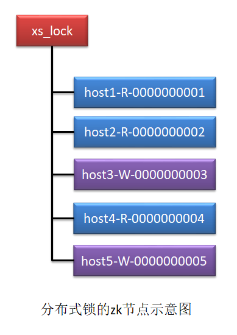

# Zookeeper应用篇

具体参考：《从Paxos到Zookeeper分布式一致性原理与实践》第６章。

## Zookeeper应用场景

8种业务场景：

+ **数据发布/订阅（配置中心）**

+ **命名服务（服务发现与注册）**

+ **DNS服务（负载均衡）**

+ **Master选举**

+ **分布式同步**

+ **集群管理/监控**

+ **分布式锁**

  实现方式：

  1）利用临时顺序节点和Watcher节点监听。客户端（工作线程）等待前一个节点的删除事件（工作线程wait(), 事件发生后通过事件处理器notify()工作线程）。
  
  2）利用同一个临时节点多个客户端同时创建只能有一个成功的特性。每个工作线程循环去尝试创建，创建失败就yield(),然后去尝试下一次的创建（借鉴FutureTask实现原理）。

+ **分布式队列**

  

##  ZK实现配置中心

### 实现原理

ZooKeeper可以通过“发布/订阅模型”实现对集群配置文件的管理与维护。
“发布/订阅模型”分为推模式(Push)与拉模式(Pull)。zk 的“发布/订阅模型”采用的是推拉相结合的模式。

**核心逻辑无非下面几点**：

+ 管理后台增删改查配置
+ 应用端监听配置，配置有更新执行回调

无论是管理后台还是应用端都是ZK集群的客户端。

### 代码实现

代码模块: zk-configcenter

１）首先读取各个微服务的配置文件，在ZK中创建对应的节点（每个微服务实例创建一个顺序节点，下面再为每个配置文件创建一个节点），同时建立一个全局配置节点用于所有配置共用，初始化时读取微服务的数据写入对应的znode节点；

２）订阅者启动后，需要向ZK集群注册watcher监听，并实现watcher事件处理器（收到watcher事件后读取本微服务对应的znode, 将数据刷新到本地配置文件，使用@RefreshScope注解使配置文件不重启生效）；

３）实现发布者web应用，发布者可以读取配置文件的znode节点树和数据，最好是做个前端页面显示出来并可编辑；修改完成后写回到znode; 然后推送watch事件。

有个问题：配置修改后不重启如何实现配置刷新？SpringCloud @RefreshScope是怎么实现的？

## ZK实现命名服务

### 实现原理

比如使用上面app节点代表电商系统，使用order、pay节点代表微服务，再里面的顺序节点代表微服务的多个实例（微服务IP、端口、路由等数据存在这个节点的data中还是应该存储在子znode节点中？）。

### 代码实现

## ZK实现DNS服务

### 实现原理

服务的节点使用ZK**临时节点**实现，如果一个服务多个节点，使用**临时顺序节点**实现。

### 代码实现

## ZK实现Master选举

### 实现原理

使用ZK中多个客户端对同一节点进行创建，只有一个客户端可以创建成功的特性实现。

**具体实现步骤**：
１）多个客户端同时发起对同一个临时节点/master-election/master 的创建请求,最
终只有一个客户端可以成功。那么这个成功的客户端就将作为 master,其它客户端就是
slave。
２）让 slave 都向这个临时节点的父节点/master-election 注册子节点列表变更的
watcher 监听
３）一旦该 master 宕机,临时节点/master 就消失了。其消失将会引发所有原来的
slave 触发 watcher,执行它们的回调。再次发起临时节点的创建请求。

**实现案例**：广告推荐系统

### 代码实现

## ZK实现分布式同步

这里的分布式同步指的是协调分布式系统多个组件之间的执行的先后顺序，或者控制是否执行。

### 实现原理

**实现案例**：ZK实现MySQL数据复制总线

MySQL 数据复制总线是一个实时数据复制框架,用于在**不同的 MySQL 数据库对象(异构[不同表])间进行异步数据复制**。其核心部分由三部分组成:生产者、复制管道、消费者。

### 代码实现

## ZK实现集群管理/监控

监控当前集群中各个主机的运行时状态，当前集群中主机的存活状况。

### 实现原理

实时监控系统注册监听子节点列表变更和子节点数据变更。

**实现案例**：ZK管理分布式日志收集系统

### 代码实现

## ZK实现分布式锁

### 实现原理

这里是实现**公平的分布式读写锁**的过程：

１）发送第一个读写请求时创建根节点xs_lock;

２）读写请求之前先创建自己的读写操作的临时顺序节点；

３）临时顺序节点创建完成后获取根节点下与当前操作互斥且编号靠前的一个子节点，注册watcher监听；如果没有与当前操作互斥的操作，则直接执行自己的操作；

４）如果存在互斥的操作则监听watcher等待它们执行完毕，把临时节点删掉（注意每次watcher回调都要重新看下子节点列表是否还存在比当前节点编号小且操作互斥的节点，有的话重新注册watcher监听这个节点），直到没有互斥的操作存在然后执行自己的操作。

５）自己的操作执行完毕退出会话连接，临时节点删除，zk通知监听这个临时节点的后续节点处理。

> 应该先创建节点后再注册watcher监听。
>
> 有没有可能正注册watcher监听某节点的时候，这个被监听的节点被删除，而watcher确注册成功的可能？这种问题ZK应该不存在，不然感觉就是Bug了。不过后面还是要确认下源码的相关实现确认下。

### 代码实现

## ZK实现分布式队列

ZK可以简单地模拟分布式队列，但是其实并不适合使用ZK实现分布式队列。

使用分布式队列还是要借助专门的中间件。

### 实现原理

#### 分布式FIFO队列

**实现流程**：

上面的图提供了一种实现思路，逻辑已经很清楚了。

生产者将数据写入一个子节点，消费者注册对前一个节点的监听子节点列表变更，前一个节点被清除，回调执行当前消费者消费逻辑，执行完毕删除被消费的节点，然后通知下一个消费者。

#### 分布式CyclicBarrier实现

**实现流程**：

在 zk 中创建一个/barrier 节点,其数据内容设置为屏障的阈值,即当其下的子节点数量达到该阈值后,app 才可进行最终的计算,否则一直等。每一个并行运算完成,都会在/barrier 下创建一个子节点,直到所有并行运算完成。

### 代码实现

