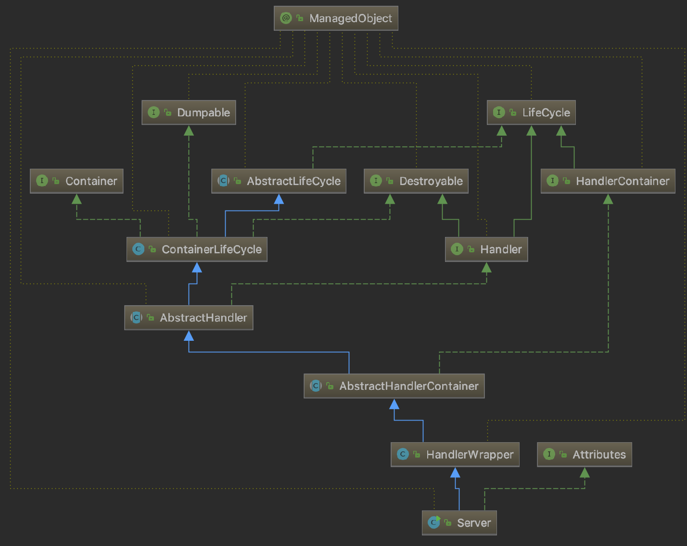

## Zookeeper源码分析

源码分析参考 zk-src-debug 测试模块。

**目标**：

+ 客户端连接服务端进行一些基本操作的实现原理
+ Watcher实现原理
+ 服务节点数据一致性原理
+ Leader选举原理
+ ACL控制原理
+ Zookeeper数据持久化原理

**源码准备：**

首先需要下载Zookeeper的源码（这里下载的是zookeeper-3.5.5），并用Ant编译（因为zookeeper源码下载后直接运行会显示某些包不存在，zookeeper中使用了jute，大概和protobuf一样的工作原理，即有些通信协议相关代码需要编译生成）。

Ant编译指令：`ant eclipse`, 操作过程中发现提示错误`Invalid bz2 file`, 原因是build.xml 1932行的路径下载文件总是不完整，需要改为如下地址

```xml
<get src="https://nchc.dl.sourceforge.net/project/ant-eclipse/ant-eclipse/1.0/ant-eclipse-1.0.bin.tar.bz2"
            dest="${java.server.resources.dir}/ant-eclipse-1.0.bin.tar.bz2" usetimestamp="false" />
```

然后重新执行Ant编译；然后将编译生成的Eclipse工程导入到IDEA。

可以在`zkServer.sh`中添加 `set -x`打印执行过的命令。

### 1 服务端源码分析

#### 1.1 服务端架构


#### 1.2 服务端启动原理

##### 1.2.1 服务端启动入口

`zkServer.sh`中有一行代码

```shell
nohup "$JAVA" "-Dzookeeper.log.dir=${ZOO_LOG_DIR}" "-Dzookeeper.root.logger=${ZOO_LOG4J_PROP}" \
    -cp "$CLASSPATH" $JVMFLAGS $ZOOMAIN "$ZOOCFG" > "$_ZOO_DAEMON_OUT" 2>&1 < /dev/null &
```

这行执行时真实的命令是

```shell
nohup /Library/Java/JavaVirtualMachines/jdk1.8.0_191.jdk/Contents/Home/bin/java -Dzookeeper.log.dir=/opt/apache-zookeeper-3.5.5-bin/bin/../logs -Dzookeeper.log.file=zookeeper-lee-server-LeeMB.local.log -Dzookeeper.root.logger=INFO,CONSOLE -XX:+HeapDumpOnOutOfMemoryError '-XX:OnOutOfMemoryError=kill -9 %p' -cp '/opt/apache-zookeeper-3.5.5-bin/bin/../zookeeper-server/target/classes:/opt/apache-zookeeper-3.5.5-bin/bin/../build/classes:/opt/apache-zookeeper-3.5.5-bin/bin/../zookeeper-server/target/lib/*.jar:/opt/apache-zookeeper-3.5.5-bin/bin/../build/lib/*.jar:/opt/apache-zookeeper-3.5.5-bin/bin/../lib/zookeeper-jute-3.5.5.jar:/opt/apache-zookeeper-3.5.5-bin/bin/../lib/zookeeper-3.5.5.jar:/opt/apache-zookeeper-3.5.5-bin/bin/../lib/slf4j-log4j12-1.7.25.jar:/opt/apache-zookeeper-3.5.5-bin/bin/../lib/slf4j-api-1.7.25.jar:/opt/apache-zookeeper-3.5.5-bin/bin/../lib/netty-all-4.1.29.Final.jar:/opt/apache-zookeeper-3.5.5-bin/bin/../lib/log4j-1.2.17.jar:/opt/apache-zookeeper-3.5.5-bin/bin/../lib/json-simple-1.1.1.jar:/opt/apache-zookeeper-3.5.5-bin/bin/../lib/jline-2.11.jar:/opt/apache-zookeeper-3.5.5-bin/bin/../lib/jetty-util-9.4.17.v20190418.jar:/opt/apache-zookeeper-3.5.5-bin/bin/../lib/jetty-servlet-9.4.17.v20190418.jar:/opt/apache-zookeeper-3.5.5-bin/bin/../lib/jetty-server-9.4.17.v20190418.jar:/opt/apache-zookeeper-3.5.5-bin/bin/../lib/jetty-security-9.4.17.v20190418.jar:/opt/apache-zookeeper-3.5.5-bin/bin/../lib/jetty-io-9.4.17.v20190418.jar:/opt/apache-zookeeper-3.5.5-bin/bin/../lib/jetty-http-9.4.17.v20190418.jar:/opt/apache-zookeeper-3.5.5-bin/bin/../lib/javax.servlet-api-3.1.0.jar:/opt/apache-zookeeper-3.5.5-bin/bin/../lib/jackson-databind-2.9.8.jar:/opt/apache-zookeeper-3.5.5-bin/bin/../lib/jackson-core-2.9.8.jar:/opt/apache-zookeeper-3.5.5-bin/bin/../lib/jackson-annotations-2.9.0.jar:/opt/apache-zookeeper-3.5.5-bin/bin/../lib/commons-cli-1.2.jar:/opt/apache-zookeeper-3.5.5-bin/bin/../lib/audience-annotations-0.5.0.jar:/opt/apache-zookeeper-3.5.5-bin/bin/../zookeeper-*.jar:/opt/apache-zookeeper-3.5.5-bin/bin/../zookeeper-server/src/main/resources/lib/*.jar:/opt/apache-zookeeper-3.5.5-bin/bin/../conf:' -Xmx1000m -Dcom.sun.management.jmxremote -Dcom.sun.management.jmxremote.local.only=false org.apache.zookeeper.server.quorum.QuorumPeerMain /opt/apache-zookeeper-3.5.5-bin/bin/../conf/zoo.cfg
```

而`$ZOOMAIN`指向`org.apache.zookeeper.server.quorum.QuorumPeerMain`。

所以`QuorumPeerMain#main()`就是启动入口。而且参数就只有zoo.cfg的路径。

先在conf下面创建zoo.cfg内容拷贝zoo_sample.cfg。Idea的Program arguments设置`conf/zoo.cfg`。然后就可以Debug了。源码代码量有点大，选择根据业务线分析，省略不重要的细节。

如果调试伪集群zoo.cfg修改：

```
//zoo1.cfg
tickTime=2000
initLimit=10
syncLimit=5
dataDir=/Users/lee/mywork/java/distribution/zookeeper/debug/zoo1/data
dataLogDir=/Users/lee/mywork/java/distribution/zookeeper/debug/zoo1/logs
clientPort=2181
server.1=localhost:2287:3387
server.2=localhost:2288:3388
server.3=localhost:2289:3389

//zoo2.cfg
tickTime=2000
initLimit=10
syncLimit=5
dataDir=/Users/lee/mywork/java/distribution/zookeeper/debug/zoo2/data
dataLogDir=/Users/lee/mywork/java/distribution/zookeeper/debug/zoo2/logs
clientPort=2181
server.1=localhost:2287:3387
server.2=localhost:2288:3388
server.3=localhost:2289:3389

//zoo3.cfg
tickTime=2000
initLimit=10
syncLimit=5
dataDir=/Users/lee/mywork/java/distribution/zookeeper/debug/zoo3/data
dataLogDir=/Users/lee/mywork/java/distribution/zookeeper/debug/zoo3/logs
clientPort=2181
server.1=localhost:2287:3387
server.2=localhost:2288:3388
server.3=localhost:2289:3389
```

然后建立三个启动器。

##### 1.2.2 服务端启动流程

先研究单节点启动，程序参数“conf/zoo.cfg”；JVM参数"-Dlog4j.configuration=file:/Users/lee/mywork/java/distribution/zookeeper/conf/log4j.properties"。

然后单步调试。

```java
QuorumPeerMain#main()
  QuorumPeerMain#initializeAndRun()
    //1）解析配置，即zoo.cfg; 配置文件的配置都读到了QuorumPeerConfig实例中
    QuorumPeerConfig#parse(args[0])
    //2) 启动数据文件夹清除管理器 
    DatadirCleanupManager#start()
    //3) 是否是集群
    //3.1）是集群
    QuorumPeerMain#runFromConfig()
    //3.2) 是单机
    ZooKeeperServerMain#main(args) //args[0] 是 "conf/zoo.cfg"
      ZooKeeperServerMain#initializeAndRun()
      //3.2.1）
      ManagedUtil#registerLog4jMBeans();
	  //3.2.2）借助QuorumPeerConfig读取并拷贝部分配置数据（ServerConfig比QuorumPeerConfig少了很多属性）
	  ServerConfig#parse(args[0])
      //3.2.3）
      ZooKeeperServerMain#runFromConfig(ServerConfig config)
        //3.2.3.1）创建
        ZooKeeperServer zkServer = new ZooKeeperServer();
        //3.2.3.2）AdminServer服务器启动[详细参考下面分析]就是启动Jetty服务器
        adminServer = AdminServerFactory.createAdminServer();
        adminServer.setZooKeeperServer(zkServer);
        adminServer.start();
      	//3.2.3.3）
        cnxnFactory = ServerCnxnFactory.createFactory();
        cnxnFactory.configure(config.getClientPortAddress(), config.getMaxClientCnxns(), false);
        cnxnFactory.startup(zkServer);
        //3.2.3.4）
        secureCnxnFactory = ServerCnxnFactory.createFactory();
        secureCnxnFactory.configure(config.getSecureClientPortAddress(), config.getMaxClientCnxns(), true);
        secureCnxnFactory.startup(zkServer, needStartZKServer);
        //3.2.3.5）
        containerManager.start();
```

+ **集群还是单机的判断**

+ **Zookeeper退出原理**

  主线程等待`CountDownLatch`实例的值为0，然后执行`shutdown()`。

  `CountDownLatch`实例被注册到 `ZooKeeperServer` 的`ZooKeeperServerShutdownHandler`, 所以猜想一定在某种场景下会调用`ZooKeeperServerShutdownHandler`将内部的`CountDownLatch`执行`countDown()`从而触发主线程退出。

+ **四个组件**

  - **JettyAdminServer**

    组合了**Server**和**ZooKeeperServer**。

    

    `Server`才是真正的服务器，基于Jetty（轻量级Web服务器）。

    JettyAdminServer的启动：

    ```java
    JettyAdminServer#start()
      //启动Jetty服务器（后面都是Jetty启动流程不用管）
      Server#start() 
        //设置启动状态标志 AbstractLifeCycle#_state 1（启动中）
        //实际启动
        Server#doStart()
          //从Bean容器获取ErrorHandler（没有就新建）组合到Server中
          //使用ShutdownMonitor（使用静态内部类实现的单例模式）监听自身的生命周期（Server本身间接实现了LifeCycle，而ShutdownMonitor单例拥有Server的实例引用）
          ShutdownMonitor#start()
        	//首先判断一下监听器状态是否已经启动
        	//没有启动则启动一个线程这个线程建立socket服务，用于连接Jetty并不断监听Jetty服务的指令
        	//五种指令
        	ShutdownMonitor#listen()		//建立socket连接
        	ShutdownMonitorRunnable#run()	//轮询监听服务端命令
          //设置HttpGenerator的Jetty版本
          //启动Jetty服务器线程池（作为ShutdownMonitor的Socket客户端）
          QueuedThreadPool
        //设置启动状态标志 AbstractLifeCycle#_state 2（启动完成）
    ```

  - **ServerCnxnFactory**
  - **ContainerManager**

### 2 客户端源码分析

#### 2.1 zkCli.sh

Zookeeper默认实现了一个简单的客户端，就是zkCli.sh中的

```shell
"$JAVA" "-Dzookeeper.log.dir=${ZOO_LOG_DIR}" "-Dzookeeper.root.logger=${ZOO_LOG4J_PROP}" \
     -cp "$CLASSPATH" $CLIENT_JVMFLAGS $JVMFLAGS \
     org.apache.zookeeper.ZooKeeperMain "$@"
```

所以`ZooKeeperMain#main()`就是启动入口。

```java
ZooKeeperMain#main()
//解析传参 {"-server","localhost:2181,localhost:2182,localhost:2183"}
//连接服务端（根据传参，判断是否readonly、secure连接是否启动..）
	ZooKeeper#ZooKeeper(String connectString, int sessionTimeout, Watcher watcher,
            boolean canBeReadOnly, HostProvider aHostProvider,
            ZKClientConfig clientConfig)
    //设置客户端配置，如果为空则使用默认配置
   	//创建默认的 ZkWatcherManager
	//设置 ZkWatherManager 默认的监听器 watcher
	//根据传参指定HostProvider
	//创建 ClientCnxn（Netty长连接）
		TODO..
	//启动 ClientCnxn
```

+ **ZooKeeper**

  源码中默认的客户端。

+ **ZkClientConfig**

+ **ZkWatcherManager**

+ **HostProvider**

+ **ClientCnxn**

##### 2.1.1 Zk命令的解析和执行

```java
ZooKeeperMain#main()
	ZooKeeperMain#run()
		ZooKeeperMain#processCmd()
			ZooKeeperMain#processZKCmd()
			//客户端初始化阶段将每一种依赖连接的命令都创建了一个CliCommand实例
			//此方法首先判断命令类型，找到对应的CliComand实例，然后解析并执行命令
				CliCommand#parse()
				CliCommand#exec()
				
```

+ **ls** (LsCommand)

  ```java
  LsCommand#parse()
  //解析命令内容到CommandLine对象，如"ls -swR /zk_test", CommandLine 包含一个LinkedList对象(存放命令和参数)和 ArrayList对象（存放可选项“s、w、R”）
  LsCommand#obtainCompatibility()
  //只是为了兼容已经被 Deprecated 的 `ls path watch` 命令
  LsCommand#exec()
  //解析CommandLine都配置了哪些可选项
  //配置了"R"
  	ZKUtil#visitSubTreeDFS(ZooKeeper zk, final String path, boolean watch,
          StringCallback cb)
      //
  //否则
  	ZooKeeper#getChildren(String path, boolean watch, Stat stat)
      //
  ```


#### 2.2 ZkClient

#### 2.3 Curator

